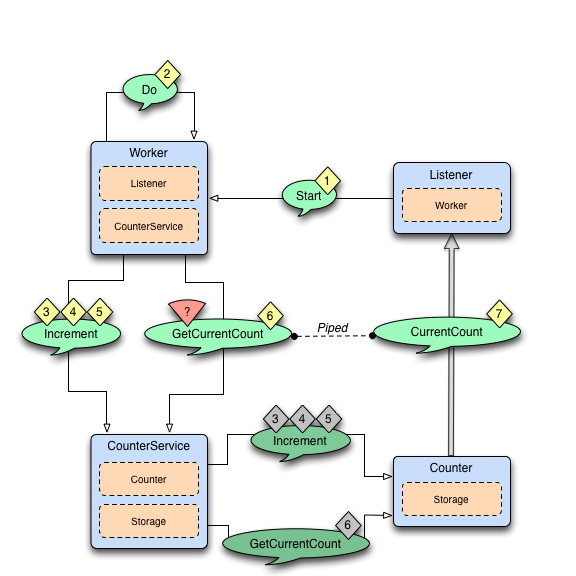
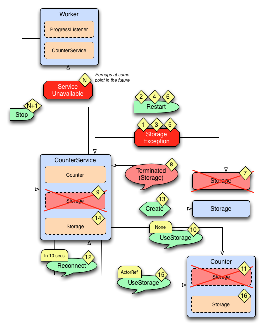

# 容错

如[Actor系统](../general/actor-systems.md) 中所述，每一个actor是其子actor的监管者 , 而且每一个actor会定义一个处理错误的监管策略。这个策略制定以后不能修改，因为它集成为actor系统结构的一部分。

## 1 实际中的错误处理

首先我们来看一个例子，演示处理数据存储错误的一种方法，数据存储错误是真实应用中的典型错误类型。当然在实际的应用中这要依赖于当数据存储发生错误时能做些什么，在这个例子中，我们使用尽量重新连接的方法。

阅读以下源码。其中的注释解释了错误处理的各个片段以及为什么要加上它们。我们还强烈建议运行这个例子，因为根据日志输出来理解运行时都发生了什么会比较容易。

### 容错例子的图解



上图展示了正常的消息流。

正常流程：

--- | ---
步骤 | 描述
1 | `Listener`启动工作的过程。
2 | `Worker` 通过定期向自己发送 `Do` 消息来安排工作
3、4、5 | 接收到`Do`时`Worker`通知`CounterService`更新计数器值, 三次。`Increment`消息被转发给`Counter`, 它会更新自己的计数器变量并将当前值发给`Storage`。
6、7 | `Worker`向`CounterService`请求计数器的当前值并将结果回送给`Listener`。



上图展示了当发生数据存储失败时的过程。

失败流程：

--- | ---

步骤 | 描述
1 | `Storage` 抛出 `StorageException`异常
2 | `CounterService` 是 `Storage` 的监管者， `StorageException`被抛出时它将 `Storage` 重启。
3，4，5，6 | `Storage` 仍旧失败，又被重启
7 | 在5秒内三次失败和重启后 `Storage` 被它的监管者`CounterService`终止。
8 | `CounterService` 同时观察着 `Storage` 并在`Storage`被终止时收到 `Terminated `消息
9，10，11 | 告诉 `Counter` 当前没有可用的 `Storage`。
12 | `CounterService` 计划给自己发一个` Reconnect` 消息
13，14 | 收到 `Reconnect` 消息后它创建一个新的 `Storage`
15，16 | 通知 `Counter` 使用新的 `Storage`

### 容错例子的完整源代码

```scala
import akka.actor._
import akka.actor.SupervisorStrategy._
import scala.concurrent.duration._
import akka.util.Timeout
import akka.event.LoggingReceive
import akka.pattern.{ ask, pipe }
import com.typesafe.config.ConfigFactory


//运行这个例子
object FaultHandlingDocSample extends App {
  import Worker._

  val config = ConfigFactory.parseString("""
    akka.loglevel = DEBUG
    akka.actor.debug {
      receive = on
      lifecycle = on
    }
    """)

  val system = ActorSystem("FaultToleranceSample", config)
  val worker = system.actorOf(Props[Worker], name = "worker")
  val listener = system.actorOf(Props[Listener], name = "listener")
  // 开始工作并监听进展
  // 注意监听者被用作tell的sender,
  // i.e. 它会接收从worker发来的应答
  worker.tell(Start, sender = listener)
}


//监听worker的进展，当完成到足够的程度时关闭整个系统
class Listener extends Actor with ActorLogging {
  import Worker._
  // 如果15秒没有任何进展说明服务不可用
  context.setReceiveTimeout(15 seconds)
 
  def receive = {
    case Progress(percent) =>
      log.info("Current progress: {} %", percent)
      if (percent >= 100.0) {
        log.info("That's all, shutting down")
        context.system.shutdown()
      }
    case ReceiveTimeout =>
      // 15秒没有进展，服务不可用
      log.error("Shutting down due to unavailable service")
      context.system.shutdown()
  }
}

object Worker {
  case object Start
  case object Do
  case class Progress(percent: Double)
}

 // Worker接收到 `Start` 消息时开始处理工作.
 // 它持续地将当前``进展``通知 `Start` 消息的发送方
 // `Worker` 监管 `CounterService`.

class Worker extends Actor with ActorLogging {
  import Worker._
  import CounterService._
  implicit val askTimeout = Timeout(5 seconds)

  // 如果 CounterService 子actor抛出 ServiceUnavailable异常则终止它
  override val supervisorStrategy = OneForOneStrategy() {
    case _: CounterService.ServiceUnavailable =>Stop
  }

  // 最初 Start 消息的发送方将持续地收到进展通知
  var progressListener: Option[ActorRef] = None
  val counterService = context.actorOf(Props[CounterService], name = "counter")
  val totalCount = 51

  def receive = LoggingReceive {
    case Start if progressListener.isEmpty =>
      progressListener = Some(sender)
      context.system.scheduler.schedule(Duration.Zero, 1 second, self, Do)
    case Do =>
      counterService ! Increment(1)
      counterService ! Increment(1)
      counterService ! Increment(1)
      // 将当前进展发送给最初的发送方
      counterService ? GetCurrentCount map {
        case CurrentCount(_, count) =>Progress(100.0 * count / totalCount)
      } pipeTo progressListener.get
  }
}

object CounterService {
  case class Increment(n: Int)
  case object GetCurrentCount
  case class CurrentCount(key: String, count: Long)
    class ServiceUnavailable(msg: String) extends RuntimeException(msg)
    private case object Reconnect
}

 // 将从 `Increment` 消息中获取的值加到持久的计数器上。
 // 在被请求 `CurrentCount` 时将 `CurrentCount` 作为应答。
 // `CounterService` 监管 `Storage` 和 `Counter`。
 
 class CounterService extends Actor {
   import CounterService._
   import Counter._
   import Storage._
  
   // 在抛出 StorageException 时重启 Storage 子actor.
   // 如果5秒内有3次重启，它将被终止.
   override val supervisorStrategy = OneForOneStrategy(maxNrOfRetries = 3, withinTimeRange = 5 seconds) {
     case _: Storage.StorageException => Restart
   }
  
   val key = self.path.name
   var storage: Option[ActorRef] = None
   var counter: Option[ActorRef] = None
   var backlog = IndexedSeq.empty[(ActorRef, Any)]
   val MaxBacklog = 10000
  
   override def preStart() {
     initStorage()
   }
  
   
   //storage 子actor在失败时将被重启，但是3次重启后如果仍失败，它将被终止。
   //这样比一直不断的失败要好
   //它被终止后我们将在一段延时后安排重新连接.
   //监视子actor，这样在它终止后我们能收到`Terminated` 消息.
   
   def initStorage() {
     storage = Some(context.watch(context.actorOf(Props[Storage], name = "storage")))
     // 告诉计数器（如果有的话），使用新的storage
     counter foreach { _ ! UseStorage(storage) }
     // 我们需要初始值来开始操作
     storage.get ! Get(key)
   }
  
   def receive = LoggingReceive {
     case Entry(k, v) if k == key && counter == None =>
       // 从Storage应答得到初始值, 现在我们可以创建计数器了
       val c = context.actorOf(Props(new Counter(key, v)))
       counter = Some(c)
       // 告诉计数器使用当前 storage
       c ! UseStorage(storage)
       // 并将缓存的积压消息发给计数器
       for ((replyTo, msg) <- backlog) c.tell(msg, sender = replyTo)
       backlog = IndexedSeq.empty
     case msg @ Increment(n)   => forwardOrPlaceInBacklog(msg)
     case msg @ GetCurrentCount => forwardOrPlaceInBacklog(msg)
     case Terminated(actorRef) if Some(actorRef) == storage =>
       // 3次重启后 storage 子actor被终止了.
       // 我们收到 Terminated 是因为我们监视了这个子actor.
       storage = None
       // 告诉计数器现在没有 storage 可用了
       counter foreach { _ ! UseStorage(None) }
       // 过一会尝试重新建立 storage 
       context.system.scheduler.scheduleOnce(10 seconds, self, Reconnect)
     case Reconnect =>
       // 在计划的延时后重新创建 storage 
       initStorage()
   }
  
   def forwardOrPlaceInBacklog(msg: Any) {
     // 在开始委托给计数器之前我们需要从storage中获取初始值 .
     // 在那之前我们将消息放入积压缓存中，在计数器初始化完成后将这些消息发给它。
     counter match {
       case Some(c) => c forward msg
       case None =>
         if (backlog.size >= MaxBacklog)
           throw new ServiceUnavailable("CounterService not available, lack of initial value")
         backlog = backlog :+ (sender, msg)
     }
   }
 }
 
 object Counter {
   case class UseStorage(storage: Option[ActorRef])
 }
 
 //如果当前有可用的 storage的话， 计数器变量将当前的值发送给`Storage`
 class Counter(key: String, initialValue: Long) extends Actor {
   import Counter._
   import CounterService._
   import Storage._

   var count = initialValue
   var storage: Option[ActorRef] = None
   def receive = LoggingReceive {
     case UseStorage(s) =>
       storage = s
       storeCount()
     case Increment(n) =>
       count += n
       storeCount()
     case GetCurrentCount =>
       sender() ! CurrentCount(key, count)

   }
   def storeCount() {
     // 委托危险的工作，来保护我们宝贵的状态.
     // 没有 storage 我们也能继续工作.
     storage foreach { _ ! Store(Entry(key, count)) }
   }

 }
 
 object Storage {
   case class Store(entry: Entry)
   case class Get(key: String)
   case class Entry(key: String, value: Long)
   class StorageException(msg: String) extends RuntimeException(msg)
 }

 // 收到 `Store` 消息时将键/值对保存到持久storage中.
 // 收到 `Get` 消息时以当前值作为应答 .
 // 如果背后的数据存储出问题了，会抛出 StorageException.
 class Storage extends Actor {
   import Storage._
   val db = DummyDB
   def receive = LoggingReceive {
     case Store(Entry(key, count)) => db.save(key, count)
     case Get(key)                 => sender() ! Entry(key, db.load(key).getOrElse(0L))
 } }
 object DummyDB {
   import Storage.StorageException
   private var db = Map[String, Long]()
   @throws(classOf[StorageException])
   def save(key: String, value: Long): Unit = synchronized {
     if (11 <= value && value <= 14)
       throw new StorageException("Simulated store failure " + value)
     db += (key -> value)
   }
   @throws(classOf[StorageException])
   def load(key: String): Option[Long] = synchronized {
     db.get(key)
   }
 }
```