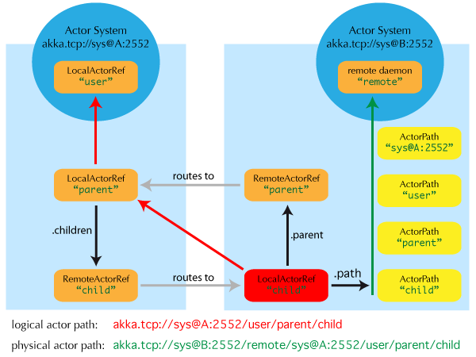

# Actor引用，路径和地址

本节描述actor如何鉴别身份，在一个可能为分布式的actor系统中如何定位。这与Actor系统的核心概念有关：固有的树形监管结构和在跨多个网络节点的actor之间进行透明通讯。


以上图片显示了actor系统中最重要的实体，请继续阅读一下信息了解详情。

## Actor引用是什么？

Actor引用是 `ActorRef` 的子类，它的最重要功能是支持向它所代表的actor发送消息。每个actor通过`self`来访问它的标准（本地）引用，在发送给其它actor的消息中也缺省包含这个引用。反过来，在消息处理过程中，actor可以通过`sender`来访问到当前消息的发送者的引用。

根据actor系统的配置，支持几种不同的actor引用：

- 纯本地引用，在配置为不使用网络功能的actor系统中使用。这些actor引用不能在保持其功能的条件下从网络连接上向外传输。
- 支持远程调用的本地引用，在支持同一个jvm中actor引用之间的网络功能的actor系统中使用。为了在发送到其它网络节点后被识别，这些引用包含了协议和远程地址信息。
- 本地actor引用有一个子类是用于路由。 它的逻辑结构与之前的本地引用是一样的，但是向它们发送的消息会被直接重定向到它的子actor。
- 远程actor引用代表可以通过远程通讯访问的actor，i.e. 从别的jvm向他们发送消息时，Akka会透明地对消息进行序列化。
- 有几种特殊的actor引用类型，在实际用途中比较类似本地actor引用：

    - `PromiseActorRef` 表示一个`Promise`，作用是从一个actor返回的响应来完成，它是由 `ActorRef.ask` 来创建的
    - `DeadLetterActorRef`  DeadLetterActorRef是死信服务的缺省实现，所有接收方被关闭或不存在的消息都在此被重新路由
    - `EmptyLocalActorRef` 是查找一个不存在的本地actor路径时返回的：它相当于`DeadLetterActorRef`，但是它保有其路径因此可以在网络上发送，以及与其它相同路径的存活的actor引用进行比较，其中一些存活的actor引用可能在该actor消失之前得到了

- 然后有一些内部实现，你可能永远不会用上：

    - 有一个actor引用并不表示任何actor，只是作为根actor的伪监管者存在，我们称它为“时空气泡穿梭者”。
    - 在actor创建设施启动之前运行的第一个日志服务是一个伪actor引用，它接收日志事件并直接显示到标准输出上；它就是`Logging.StandardOutLogger`。
    
## Actor路径是什么?

由于actor是以一种严格的树形结构样式来创建的，沿着子actor到父actor的监管链一直到actor系统的根存在一条唯一的actor名字序列。这个序列可以类比成文件系统中的文件路径，所以我们称它为“路径”。就像在一些真正的文件系统中一样，也存在所谓的“符号链接”，也就是说，一个actor可能通过不同的路径访问到，除了原始路径外，其它的路径都是actor实际的监管祖先链的一部分。这些特性将在下面的内容中介绍。

一个actor路径包含一个标识该actor系统的锚点，之后是各路径元素的连接，从根到指定的actor；路径元素是路径经过的actor的名字，以"/"分隔。

### Actor路径锚点

每一条actor路径都有一个地址组件，描述如何访问到actor的协议和位置，之后是从根到actor所经过的树节点上actor的名字。例如：

```
"akka://my-sys/user/service-a/worker1"  //纯本地
 "akka.tcp://my-sys@host.example.com:5678/user/service-b" // 远程
```

在这里, `akka.tcp`是2.3.9版本中缺省的远程协议，其它的协议都是可插拔的。使用UDP的远程host可以通过`akka.udp`访问。对主机和端口的理解（上例中的serv.example.com:5678）决定于所使用的传输机制。

### 逻辑Actor路径

顺着actor的父监管链一直到根的唯一路径被称为逻辑actor路径。这个路径与actor的创建祖先完全吻合，所以当actor系统的远程调用配置（和配置中路径的地址部分）设置好后它就是完全确定的了。

### 物理Actor路径

逻辑Actor路径描述一个actor系统内部的功能位置，而基于配置的远程部署意味着一个actor可能在另外一台网络主机上被创建，例如在另一个actor系统中。在这种情况下，从根开始索引actor路径需要访问网络，这是一个昂贵的操作。因此，每一个actor同时还有一条物理路径，从实际的actor对象所在的actor系统的根开始。与其它actor通信时使用物理路径作为发送方引用能够让接收方直接回复到这个actor上，将路由延迟降到最小。

一个重要的方面是物理路径决不会跨多个actor系统或跨虚拟机。这意味着一个actor的逻辑路径（监管树）和物理路径（actor部署）可能会偏离（diverge），如果它的祖先被远程监管了。

## 如何获得Actor引用？

关于actor引用的获取方法分为两类：通过创建actor或者通过对actor的访问(look up)查找。后一种功能又分两种：通过具体的actor路径来创建actor引用、查询逻辑actor树。

### 创建Actor

一个actor系统通常是在根actor上使用`ActorSystem.actorOf`创建actor，然后使用`ActorContext.actorOf`从创建出的actor中生出actor树来启动的。这些方法返回指向新创建的actor的引用。每个actor都拥有到它的父亲，它自己和它的子actor的引用。这些引用可以与消息一直发送给别的actor，以便接收方直接回复。

### 通过具体的路径来查找actor

另一种查找actor引用的途径是使用`ActorSystem.actorSelection`方法。selection被用来在发送actor和回复actor之间进行通讯。

为了获得一个包含特点actor生命周期的ActorRef,你需要发送一个消息（如Identify消息）到actor，然后用sender()引用从actor而来的返回（use the sender() reference of a reply from the actor）。

#### 绝对路径 vs 相对路径

除了ActorSystem.actorSelection还有一个ActorContext.actorSelection，在任何一个actor实例中可以用context.actorSelection访问。它所返回的actor引用与ActorSystem的返回值非常类似，但它的路径查找是从当前actor开始的，而不是从actor树的根开始。可以用 ".." 路径来访问父actor. 例如，你可以向一个兄弟发送消息：

```
context.actorSelection("../brother") ! msg
```

当然绝对路径也可以在`context`中使用，例如

```
context.actorSelection("/user/serviceA") ! msg
```

### 查询逻辑Actor树

由于actor系统是一个类似文件系统的树形结构，对actor的匹配与unix shell中支持的一样：你可以将路径（中的一部分）用通配符(«*» 和 «?»)替换来组成对0个或多个实际actor的匹配。由于匹配的结果不是一个单一的actor引用，它拥有一个不同的类型ActorSelection，这个类型不完全支持ActorRef的所有操作。同样，路径选择也可以用`ActorSystem.actorSelection`或`ActorContext.actorSelection`两种方式来获得，并且支持发送消息：

```
context.actorSelection("../*") ! msg
```
会将msg发送给包括当前actor在内的所有兄弟。对于用 actorFor 获取的actor引用，为了进行消息的发送，会对监管树进行遍历。由于在消息到达其接收者的过程中与查询条件匹配的actor集合会发生变化，要监视查询的实时变化是不可能的。如果要做这件事情，通过发送一个请求，收集所有的响应来解决不确定性，提取所有的发送方引用，然后监视所有发现的具体actor。这种处理actor选择的方式会在未来的版本中进行改进。

### 总结 actorOf vs. actorSelection vs. actorFor

```
以上部分所描述的细节可以简要地总结和记忆成：

- actorOf 永远都只会创建一个新的actor，这个新的actor是actorOf所调用上下文（可以是actor系统中的任意一个actor）的直接子actor
- actorSelection 永远都只是查找到当消息已经被传递时的一个已存在的actor，不会创建新的actor。或者当selection创建时，验证已经存在的actors。
- actorFor （已经废弃）永远都只是查找到一个已存在的actor，不会创建新的actor。
```

## 与远程部署之间的互操作

当一个actor创建一个子actor，actor系统的部署者会决定新的actor是在同一个jvm中或是在其它的节点上。如果是后者，actor的创建会通过网络连接来到另一个jvm中进行，结果是新的actor会进入另一个actor系统。远程系统会将新的actor放在一个专为这种场景所保留的特殊路径下。新的actor的监管者会是一个远程actor引用（代表会触发创建动作的actor）。这时，context.parent（监管者引用）和context.path.parent（actor路径上的父actor）表示的actor是不同的。但是在其监管者中查找这个actor的名称能够在远程节点上找到它，保持其逻辑结构，例如当向另外一个未确定(unresolved)的actor引用发送消息时。



## 路径中的地址部分用来做什么？

在网络上传送actor引用时，是用它的路径来表示这个actor的。所以，它的路径必须包括能够用来向它所代表的actor发送消息的完整的信息。这一点是通过在路径字符串的地址部分包括协议、主机名和端口来做到的。当actor系统从远程节点接收到一个actor路径，会检查它的地址部分是否与自己的地址相同，如果相同，那么会将这条路径解析为本地actor引用，否则解析为一个远程actor引用。

## Akka使用的特殊路径

在路径树的根上是根监管者，所有的的actor都可以从通过它找到。在下一个层次上是以下这些：

- `"/user"` 是所有由用户创建的顶级actor的监管者，用 ActorSystem.actorOf 创建的actor
- `"/system"` 是所有由系统创建的顶级actor（如日志监听器或由配置指定在actor系统启动时自动部署的actor）的监管者
- `"/deadLetters"` 是死信actor，所有发往已经终止或不存在的actor的消息会被送到这里
- `"/temp"` 是所有系统创建的短时actor(i.e.那些用在ActorRef.ask的实现中的actor)的监管者。`ActorRef.ask`的实现会用到
- `"/remote"` 是一个人造的路径，用来存放所有其监管者是远程actor引用的actor